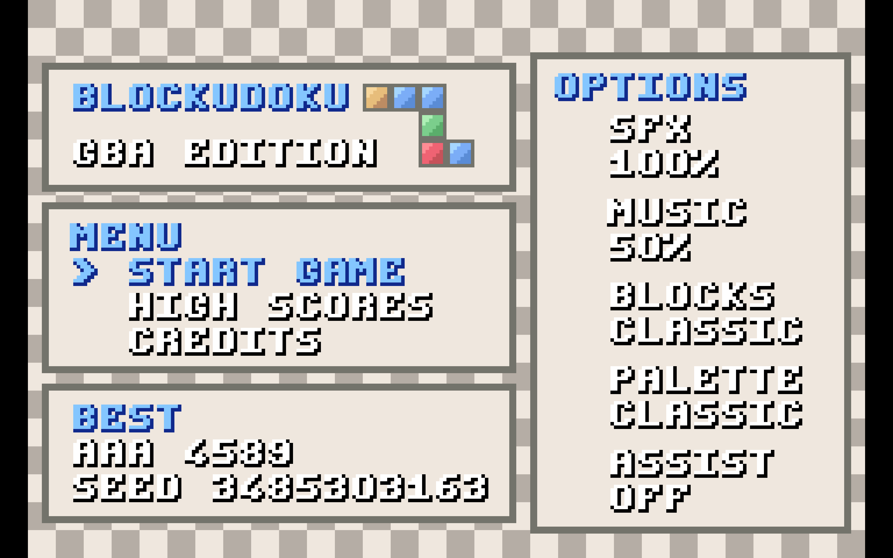
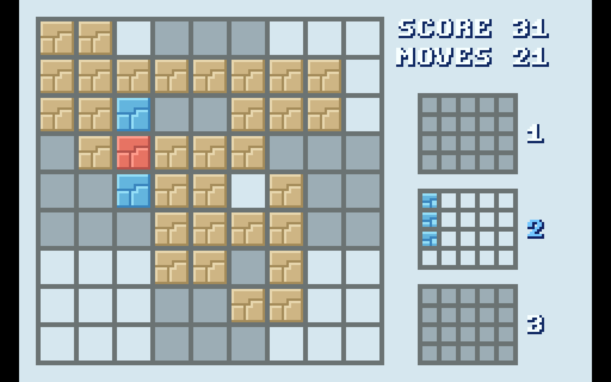
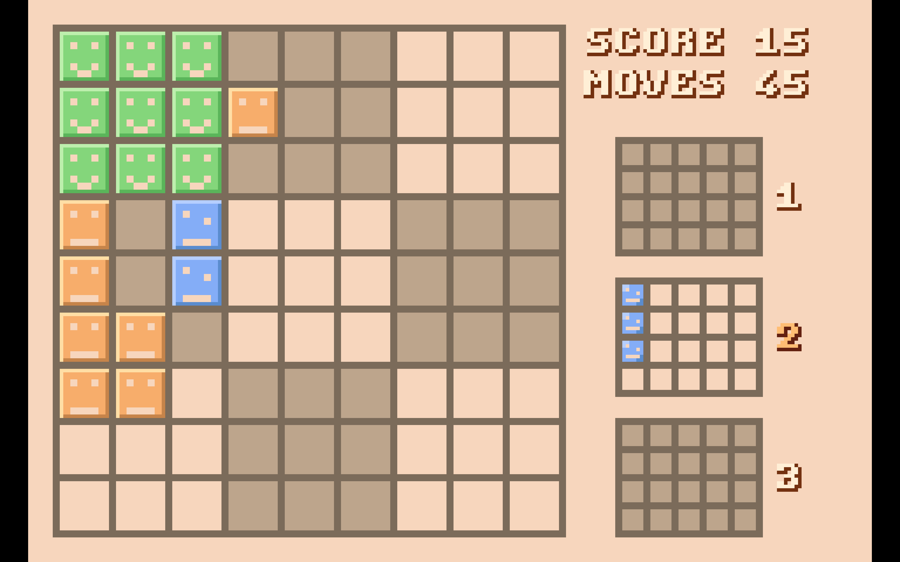
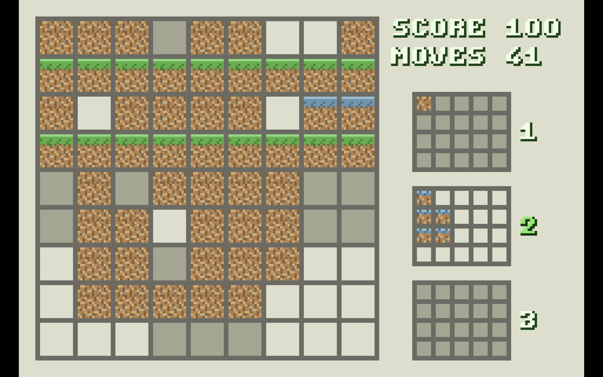
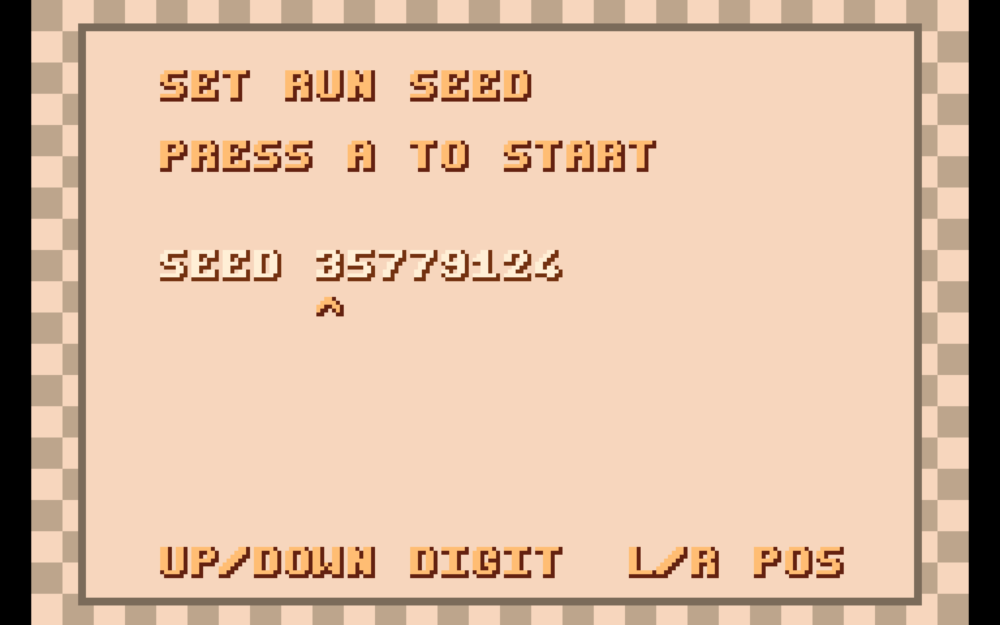

# Blockudoku GBA

A Blockudoku-inspired puzzle game built for Game Boy Advance using [Butano](https://github.com/GValiente/butano).

## Features

- 9x9 board with row, column, and 3x3 clear rules.
- 3-piece tray flow (use all 3 pieces before new deal).
- Multiple block styles and palette themes.
- Seeded runs (auto seed or manual seed entry).
- High scores saved to SRAM, including run seed.
- Hint system with separate step budgets:
  - Manual hint (`START`): higher search budget
  - Assist mode: lower per-frame budget for smoother frame pacing
- Optional assist/autoplay mode.
- Combo scoring, clear feedback, screen shake, and UI messages.
- Music + SFX with configurable volume.

## Screenshots

### Title / Menu



### Board / UI





### Gameplay Feedback


### Line Clears




### Initials / Seed Entry




### High Scores / Credits


## Requirements

- `devkitARM` toolchain
- Butano dependencies (as required by upstream Butano)
- `make`

Butano is included as a git submodule under `third_party/butano`.

## Setup

```bash
git clone https://github.com/williamjasperbehnke/Blockudoku.git
cd blockudoku
git submodule update --init --recursive
```

## Build

```bash
make -j4
```

Output ROM:

- `blockudoku.gba`

## Run

Open `blockudoku.gba` in your preferred GBA emulator (for example, mGBA).

## Controls

### Gameplay

- `D-Pad`: Move cursor (supports hold-repeat)
- `A`: Place selected piece
- `L / R`: Cycle tray piece
- `START`: Request best-move hint
- `B`: Cycle through valid hint placements
- `SELECT`: Return to main menu

### Menus / Entry Screens

- `D-Pad`: Navigate (supports hold-repeat)
- `A` / `START`: Confirm / increase selected option
- `B`: Decrease selected option (where applicable) or back
- `SELECT` (on Start Game): Open seed entry

## Project Structure

- `src/blockudoku/game_app.cpp`: top-level app flow and scene orchestration
- `src/blockudoku/game_state.cpp`: game state + scoring + run progression
- `src/blockudoku/board_rules.cpp`: board placement and clear logic
- `src/blockudoku/hint_solver.cpp`: move search/solver logic
- `src/blockudoku/ui_renderer.cpp`: UI rendering facade
- `src/blockudoku/ui_palette_provider.cpp`: palette/theme mapping and text palette data
- `src/blockudoku/gameplay_screen_renderer.cpp`: gameplay view rendering
- `src/blockudoku/menu_screen_renderer.cpp`: main menu rendering
- `src/blockudoku/info_screen_renderer.cpp`: highscores/credits/entry screens
- `src/blockudoku/game_audio.cpp`: music/SFX handling

## Assets and Attribution

- Music file in use: `audio/menu_theme.mod`
- Current credits page attributes music as:
  - `FRUIT.MOD`
  - `JESTER / SANITY`
  - `CC BY-NC-SA`

If you distribute publicly, keep/update attribution and license details for all third-party assets (music, sounds, fonts, references).
